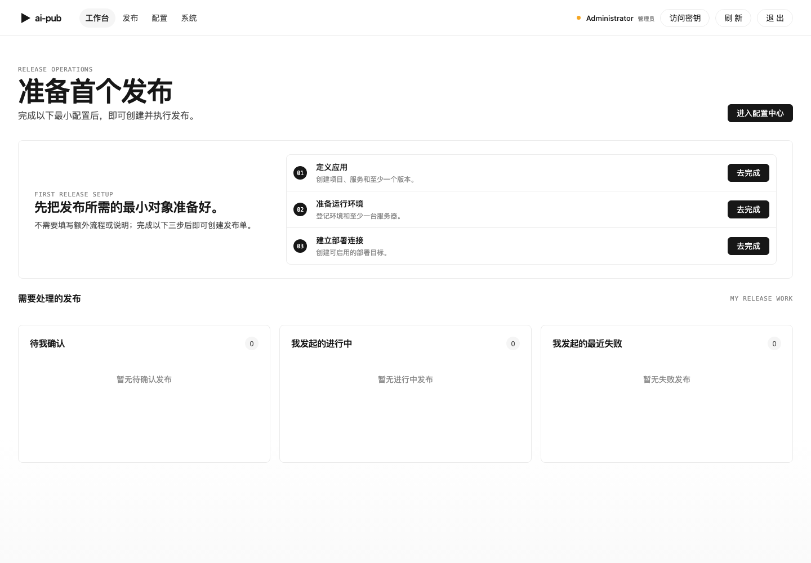
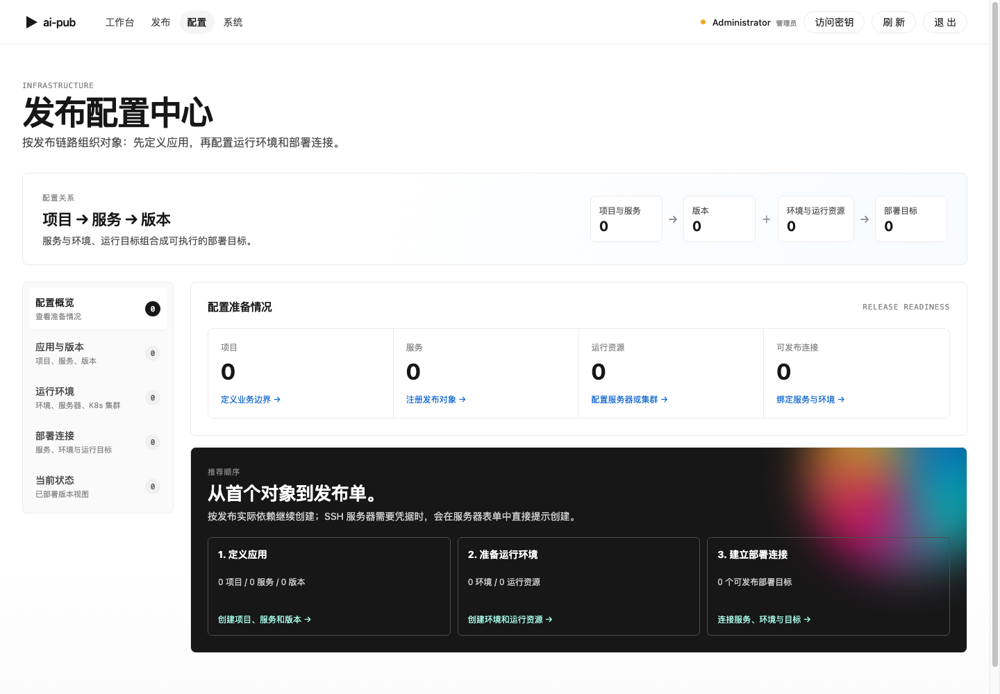

# AI Pub

[](LICENSE)


AI Pub 是一个面向中小团队的轻量发布控制面，用 Web/API 串起版本登记、发布确认、真实部署执行、事件审计和发布记录查询。

它不替代 GitLab CI/CD、Jenkins 或 Argo CD。已有平台继续负责代码、构建和制品；当团队需要把真实部署凭据和执行动作从各个 Pipeline 中收口时，AI Pub 作为所有调用方共同进入的发布控制面，统一回答“谁请求发布什么、是否允许执行、实际发到哪里、结果如何”。

## Demo

推荐先体验在线演示，再决定是否本地运行。

[体验地址：https://pub-demo.lanpang.top/](https://pub-demo.lanpang.top/)

- 体验账号：`demo`
- 体验密码：`ai-pub-demo-2026`
- 演示说明：执行器为 mock，可体验主要配置与发布流程，不会触发真实 SSH/K8s 外联。
- 数据说明：演示环境会定期重置，请勿存放敏感信息。

## 界面预览

| 工作台 | 发布配置中心 |
| --- | --- |
|  |  |

## Why AI Pub

GitLab 等平台可以直接完成 CI/CD。AI Pub 只在团队需要独立于代码仓库的发布控制面时成立：

- 多个仓库、服务和客户环境需要使用同一套发布入口与环境保护，而不是分别维护和理解每个 Pipeline。
- GitLab Runner、Web 用户和 AI Agent 都可以发起发布，但不应直接持有生产 SSH 或 K8s 凭据，也不能绕过统一 preflight、确认和审计。
- 构建完成只代表版本可用，不代表立即部署；同一不可变制品需要按业务时机发布到不同环境。
- SSH、多服务器或 K8s 直连发布需要结构化记录目标快照、节点结果、部分成功和当前版本，而不只是保留一段 Job 日志。

AI Pub 的目标不是重复 GitLab 的 Pipeline 编排，而是让自己成为受控发布动作的唯一执行入口。GitLab 负责构建事实，镜像仓库负责制品事实，AI Pub 负责发布意图和由本系统执行的发布记录；运行环境的实际状态仍应通过执行后校验或状态探测确认。

## 核心能力

- **发布对象管理**：项目、服务、版本、环境、服务器、K8s 集群和部署目标。
- **统一执行边界**：调用方只提交发布意图，真实部署凭据、preflight、确认门禁和执行动作集中在系统内。
- **发布执行闭环**：发布单创建、预检、确认、执行、状态追踪、重试和回滚入口。
- **可观测与审计**：发布事件、部署记录、目标日志和当前版本状态。
- **自动化接入**：REST API 与 Agent 入口，可由 CI 或 AI Agent 发起受控发布。
- **轻量运行**：Go 后端 + React 前端打包为单个应用镜像，MySQL 作为正式数据库。

## 适合场景

- 中小团队希望把发布执行、确认和记录从聊天/表格中收口出来。
- 已有构建流程，只缺少版本登记、环境选择、发布确认和部署记录。
- 希望让 GitLab Runner 只调用受限发布 API，不直接持有生产部署权限和凭据。
- 需要跨多个代码仓库统一管理服务、客户环境、服务器组或 K8s 直连目标。
- 内部系统需要保留“谁在什么时候把哪个版本发到哪个环境”的审计线索。
- 希望优先落地 MVP，而不是一次性建设复杂流水线平台。

## 不适合场景

- 替代 Jenkins、GitLab CI、Argo CD 等完整 CI/CD 或 GitOps 平台。
- 已能通过 GitLab 原生 Environment、受保护环境、公共 CI 模板和部署记录低成本满足发布要求，且没有跨仓库发布控制需求。
- 允许 Runner、管理员或其他工具绕过本系统直接修改生产环境，却仍希望本系统展示完整、可信的环境现状。
- 面向多租户商业 SaaS 的权限、计费、隔离和组织管理。
- 高并发任务调度、复杂编排、跨区域容灾等平台级能力。

## 技术栈

- 后端：Go、`net/http`、`database/sql`、显式 SQL repository。
- 前端：React、TypeScript、Vite、Ant Design。
- 数据库：MySQL 8 是生产和正式集成验收数据库；SQLite 仅用于 demo/local 轻量模式和 Go 单测。
- 打包：前后端构建到同一个 `app` 容器镜像。

## Quick Start

使用 Docker Compose 启动 MySQL 本地环境：

```bash
cd deploy
docker compose -f compose.mysql.yaml up -d
```

访问应用：[http://127.0.0.1:18080/](http://127.0.0.1:18080/)

默认管理员仅适合本地体验：

- 用户名：`admin`
- 密码：`ai-pub-dev-admin`

基于当前源码构建并启动：

```bash
make compose-up
```

更多本地运行、SQLite 轻量模式和验收说明见 [本地功能验证](docs/local-verification.md)。

## 验证

代码级检查：

```bash
make verify
```

MySQL Compose 端到端验收：

```bash
make compose-check
```

SQLite demo/local 轻量验收：

```bash
make compose-check-sqlite
```

- `make verify`：运行 Go 测试、前端 lint 和生产构建。
- `make compose-check`：从空 MySQL 数据库启动容器并执行端到端发布闭环。
- `make compose-check-sqlite`：SQLite demo/local 轻量验收，不替代 MySQL 正式验收。

## 文档

- [技术文档索引](docs/README.md)
- [API 设计](docs/api-design.md)
- [后端架构设计](docs/backend-architecture-design.md)
- [前端信息架构](docs/frontend-ia-design.md)
- [本地功能验证](docs/local-verification.md)

## Roadmap

- 完善 K8s Deployment 执行器体验与验收覆盖。
- 补齐更多 CI/Agent 接入示例。
- 增强发布记录筛选、检索和审计视图。
- 评估 PostgreSQL 支持边界。

## Contributing

欢迎通过 [GitHub Issues](https://github.com/pangerl/ai-pub/issues) 反馈问题、讨论需求或提交 PR。提交问题时请尽量包含复现步骤、期望行为和相关日志。

## License

AI Pub 使用 [MIT License](LICENSE)。
