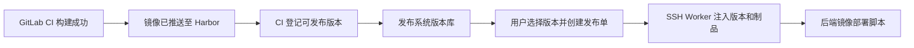

# GitLab CI 版本登记与后端镜像发布设计

## 1. 结论与范围

本设计用 GitLab CI 替代 Jenkins 的“构建完成后通知发布系统”动作，并把后端发布脚本收敛为只消费发布系统注入的版本与制品信息。

本期完成的业务闭环是：



本期范围：

- GitLab CI 成功构建后登记既有服务的后端 OCI 镜像版本。
- 发布页面从当前服务的版本库选择版本，并保留管理员手动登记版本的能力。
- SSH 执行器调用无位置参数的后端镜像部署脚本。
- 发布系统记录版本、制品、提交和 GitLab Pipeline 追溯信息。

本期不做：

- 前端静态资源发布、前端发布脚本或前端制品登记。
- Jenkins 兼容层、GitLab Webhook 事件解析、自动创建项目或服务。
- CI 成功后自动创建、自动确认或自动执行发布单。
- N9E 告警屏蔽、通用构建状态同步、制品仓库清理策略。
- 多 CI 平台抽象；接口命名保持 CI 通用，首个调用方是 GitLab CI。

## 2. 关键设计决定

### 2.1 采用 CI 主动登记 API，而非 GitLab Webhook

GitLab CI Job 在镜像推送成功后，直接调用发布系统 API 登记版本。这个动作语义明确，且只发生在制品已经可用时；不需要接收并过滤 GitLab 的多种事件。

GitLab Webhook 适合后续需要响应 merge、tag、pipeline 等多类事件，并由发布系统自行维护仓库映射时再引入。本期不需要。

### 2.2 服务必须预先存在，CI 按项目和服务 key 登记版本

CI 不传内部 `service_id`，更不允许自动创建实体。每个 GitLab 仓库在受保护变量中配置一次固定的 `AI_PUB_PROJECT_KEY`；每个单仓多服务 Job 传递自己正在构建的模块 `service_key`。发布系统按 `Project.slug + Service.slug` 找到既有服务。

`service_key` 不要求全局唯一，只需在所属项目内唯一。这样既避免 CI 耦合内部 ID，也不会因不同项目都有 `gateway`、`auth` 等服务而误匹配。服务的创建、启用和部署目标配置继续由管理员在发布系统完成。

第一版不维护 repository 实体或 repository 到服务的映射；`CI_PROJECT_PATH` 仅作为版本 metadata 保存，便于审计和跳转 GitLab。若未来单个 GitLab 仓库的服务需要归属不同发布项目，再新增 `(repository, service_key) -> service_id` 显式映射。

### 2.3 制品引用是部署真相

`version` 用于人类选择和展示；`artifact_url` 用于实际部署。对于后端镜像，`artifact_url` 必须是已推送镜像的完整不可变引用，优先使用：

```text
harbor.example/team/order-api@sha256:<digest>
```

不能只依赖可被覆盖的 `latest` 或普通 tag。CI 可同时把便于阅读的 tag 作为 `version` 保存。

### 2.4 发布只能选择已登记的版本

创建发布单时，版本列表只显示当前服务的版本，按登记时间倒序，并支持按版本号、短 SHA 搜索。长版本号在列表中截断展示，详情与复制操作保留完整值。

“手动输入版本”表示管理员手动登记一个 `ServiceVersion(source=manual)`，登记后再被选择；不允许通过自由文本绕过版本记录直接创建发布单。

## 3. 版本登记接口

使用统一资源路径：

```text
POST /api/v1/ci/version-registrations
```

管理员仍通过服务版本管理接口手动登记版本；GitLab CI 只调用上述统一接口。CI 调用时服务端强制写入 `source=ci`、`created_by_type=api_key` 和调用方 ID，不能由请求体伪造。

需要新增 `version:write` API Key scope。它只允许登记版本，不可创建服务、修改部署目标或执行发布；GitLab Group 只保存一个受保护、掩码显示的 API Key。即使发布系统仅在内网运行，也不能移除鉴权：该接口决定后续可被部署的制品。

### 3.1 请求体

```json
{
  "project_key": "food-supply",
  "service_key": "order-api",
  "version": "2026.06.23-1842",
  "commit_sha": "7f3c6b5b1b4d...",
  "artifact_url": "harbor.example/team/order-api@sha256:...",
  "pipeline_id": "9281",
  "pipeline_url": "https://gitlab.example/group/order-api/-/pipelines/9281",
  "ref": "main",
  "gitlab_project_path": "group/order-api",
  "built_at": "2026-06-23T10:42:31Z"
}
```

其中 `project_key`、`service_key`、`version`、`commit_sha`、`artifact_url`、`pipeline_id`、`pipeline_url` 必填。`ref`、`gitlab_project_path`、`built_at` 可选。服务端按 `project_key + service_key` 定位服务；不接收 `service_id`。

服务端将 Pipeline、分支和构建时间写入 `ServiceVersion.metadata`，不在本期为它们新增单独字段。`created_at` 保持为发布系统首次登记时间。

不接收提交说明作为核心字段：它对发布执行没有决定作用，长度和换行也会增加日志及 JSON 处理风险；需要时可通过 `commit_sha` 跳转至 GitLab 查看。

### 3.2 幂等与冲突

CI 必须携带：

```text
Idempotency-Key: gitlab:{CI_PROJECT_ID}:{CI_PIPELINE_ID}
```

版本登记的处理规则：

| 情况 | 结果 |
|---|---|
| 首次登记 | 创建版本，返回 `201` |
| 同一服务、同一版本、同一 commit 与制品再次提交 | 返回已有版本，`200` |
| 同一服务、同一版本但 commit 或制品不同 | 返回 `409 version_conflict` |
| 项目或服务不存在、服务已禁用 | 返回 `404` 或 `409`，不自动创建 |
| 制品引用为空或不是 digest 引用 | 返回 `400` |

唯一约束继续使用 `(service_id, version)`；API Key、幂等键、来源 Pipeline 和登记结果要写入可查询审计事件。重试不得产生重复版本。

## 4. GitLab CI 调用方式

版本登记 Job 必须排在镜像 push 成功之后。CI 只负责登记制品，不运行服务器部署脚本，也不创建发布单。

示例片段（`IMAGE_DIGEST_REF` 由镜像构建/推送步骤解析得到）：

```yaml
register_release_version:
  stage: register
  needs: [build_and_push_image]
  script:
    - test -n "$AI_PUB_PROJECT_KEY"
    - test -n "$SERVICE_KEY"
    - test -n "$AI_PUB_API_KEY"
    - test -n "$IMAGE_DIGEST_REF"
    - |
      payload=$(jq -n \
        --arg project_key "${AI_PUB_PROJECT_KEY}" \
        --arg service_key "${SERVICE_KEY}" \
        --arg version "${IMAGE_VERSION}" \
        --arg commit_sha "${CI_COMMIT_SHA}" \
        --arg artifact_url "${IMAGE_DIGEST_REF}" \
        --arg pipeline_id "${CI_PIPELINE_ID}" \
        --arg pipeline_url "${CI_PIPELINE_URL}" \
        --arg ref "${CI_COMMIT_REF_NAME}" \
        --arg project_path "${CI_PROJECT_PATH}" \
        --arg built_at "$(date -u +%Y-%m-%dT%H:%M:%SZ)" \
        '{project_key:$project_key, service_key:$service_key, version:$version, commit_sha:$commit_sha, artifact_url:$artifact_url, pipeline_id:$pipeline_id, pipeline_url:$pipeline_url, ref:$ref, gitlab_project_path:$project_path, built_at:$built_at}')
      curl --fail-with-body --retry 5 --retry-all-errors \
        -X POST "${AI_PUB_BASE_URL}/api/v1/ci/version-registrations" \
        -H "Authorization: Bearer ${AI_PUB_API_KEY}" \
        -H "Content-Type: application/json" \
        -H "Idempotency-Key: gitlab:${CI_PROJECT_ID}:${CI_PIPELINE_ID}" \
        --data "$payload"
```

说明：

- `AI_PUB_PROJECT_KEY`、`AI_PUB_API_KEY`、`AI_PUB_BASE_URL` 是 GitLab Group 或项目级受保护变量；`SERVICE_KEY` 是当前构建模块名。CI 不保存发布系统内部 `service_id`，也不为每个服务维护不同接口。
- `jq -n` 生成 JSON，避免提交信息、分支名或 URL 中的引号、换行破坏 JSON。
- HTTP `200` 与 `201` 都是成功；非 2xx 让 Job 失败，便于构建方修复版本登记而不是静默遗漏。
- 若 GitLab Runner 没有 `jq`，应在构建镜像中提供它；不回退到字符串拼接 JSON。

## 5. 后端镜像部署脚本契约

发布系统 SSH 执行器以环境变量调用部署目标的 `script_path`，脚本不接收位置参数。本期新增一个仅用于后端 OCI 镜像的脚本，例如：

```text
/opt/ai-pub/bin/deploy-backend-image.sh
```

### 5.1 输入边界

发布系统已有且必须保留的注入变量：

| 变量 | 作用 |
|---|---|
| `AI_PUB_VERSION` | 人类可读版本 |
| `AI_PUB_COMMIT_SHA` | 源码追溯 |
| `AI_PUB_ARTIFACT_URL` | 必填，完整 OCI digest 引用 |
| `AI_PUB_RELEASE_ID` | 发布单追溯 |
| `AI_PUB_DEPLOY_ID` | 部署记录追溯 |
| `AI_PUB_SERVICE_ID` / `AI_PUB_ENVIRONMENT_ID` | 系统对象追溯 |

部署目标的静态 `env_vars` 配置脚本所需的非敏感业务参数，例如：

| 变量 | 作用 |
|---|---|
| `APP_SERVICE_NAME` | Docker Compose 服务名和容器名，必填 |
| `APP_DEPLOY_DIR` | 每服务部署目录，例如 `/data/service/order-api` |
| `APP_ENV_FILE` | 服务器上的受保护环境文件路径 |
| `APP_HEALTHCHECK_CMD` | 可选的部署后健康检查命令 |

密码、注册表登录凭据、Nacos 配置、监控 token 等不通过 CI 回调、版本 metadata 或部署目标环境变量明文传递。它们应保存在服务器受保护环境文件、Docker 登录状态或后续凭据管理中。

### 5.2 脚本职责

`deploy-backend-image.sh` 必须：

1. 使用 `set -euo pipefail`，校验 `AI_PUB_ARTIFACT_URL`、`APP_SERVICE_NAME`、`APP_DEPLOY_DIR`。
2. 直接以 `AI_PUB_ARTIFACT_URL` 写入 Compose 配置并拉取镜像；不得根据服务名与 tag 重建镜像地址。
3. `docker compose pull` 成功后再执行 `docker compose up -d`。
4. 检查容器仍在运行；配置了 `APP_HEALTHCHECK_CMD` 时，健康检查失败必须退出非零。
5. 输出不含凭据的执行摘要（服务、版本、commit 短 SHA、release ID、deploy ID、镜像仓库路径）。
6. 所有失败都返回非零，让 Worker 将失败原因写入服务器部署日志。

脚本不应：

- 依赖 `$1`、`$2` 等位置参数。
- 包含前端 tar 包下载、Nginx 文件替换或根据服务名后缀判断类型。
- 创建或删除 N9E 告警屏蔽。
- 使用 `docker image prune -a -f` 清理共享主机的全部未运行镜像。
- 内嵌密码、API token 或其他长期凭据。

当前 `scripts/deploy.sh` 仍属于待替换的用户脚本：它要求位置参数，而执行器注入的是 `AI_PUB_*` 环境变量；同时它自行拼接镜像地址。因此不作为本设计的后端脚本基线，也不在本次文档工作中修改。

## 6. 版本选择与预检

版本登记成功后，发布页应：

1. 切换服务时只加载或筛选该服务版本。
2. 默认展示最近登记的版本，并显示 `version`、短 SHA、来源 `CI/手动`、登记时间和 Pipeline 链接。
3. 隐藏完整 `artifact_url`；详情页按现有脱敏规则展示。
4. 保留管理员“手动登记版本”入口，其字段遵循同一 `ServiceVersion` 模型。

发布前预检新增或收紧以下判断：

- CI 版本缺少 `artifact_url` 时阻断后端镜像部署，不只给 warning。
- `artifact_url` 不是 OCI digest 引用时阻断。
- 服务、版本、部署目标三者不匹配时继续沿用现有阻断。
- 环境冻结、生产管理员确认、运行中发布冲突继续沿用现有发布门禁。

## 7. 审计与故障处理

需要新增 `version_registered` 事件，至少记录：服务、版本 ID、来源 `ci/manual`、API Key ID（CI 时）、Pipeline ID、commit SHA 和脱敏制品摘要。

故障边界：

| 环节 | 行为 |
|---|---|
| 镜像 push 失败 | 不调用版本登记 |
| 登记 API 暂时失败 | GitLab Job 重试；同一请求幂等 |
| 同版本制品不一致 | 明确 `409`，由构建人员修复版本规则，不覆盖历史 |
| CI 已登记但未发布 | 正常保留为可选版本 |
| SSH 拉取或健康检查失败 | 发布失败，保留 Worker 日志与发布审计；不修改已登记版本 |

## 8. 实施顺序与验收

1. 后端：新增 `version:write` scope，改造版本创建接口的 CI 鉴权、字段校验、幂等与冲突处理，写入 `version_registered` 事件。
2. 前端：版本列表按服务筛选、搜索与长版本展示；保留手动登记入口。
3. 服务器：部署专用 `deploy-backend-image.sh` 和受保护环境文件，部署目标改为该脚本和静态 `env_vars`。
4. GitLab：在镜像 push 之后加入版本登记 Job，配置受保护变量。
5. 验收：执行一次真实非生产镜像构建、登记、手动选择、SSH 发布与健康检查；再覆盖重试幂等、版本冲突、镜像拉取失败和健康检查失败。

代码级验证至少包含受影响的 Go 单测、前端 lint/build；涉及 migration、API、Worker 和 SSH 执行路径时，再执行 `make compose-check`。真实 GitLab、Harbor、SSH 服务器属于外部集成，需在非生产环境进行一次专项验收并记录结果。
